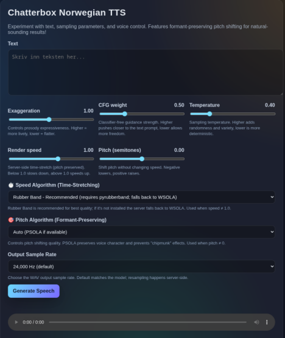

## Norwegian TTS API

Small FastAPI service wrapping `chatterbox-tts` with an inline demo UI.

Pretrained Norwegian weights are hosted on Hugging Face: https://huggingface.co/akhbar/chatterbox-tts-norwegian

### Project Structure
- `server.py` - Main FastAPI application
- `time_stretch_algorithms.py` - Modular time-stretching algorithms library
- `pitch_shift_algorithms.py` - Formant-preserving pitch shifting algorithms
- `demo.html` - Web UI for testing the TTS system

### Features
- POST `/tts` streams a WAV with adjustable `exaggeration`, `cfg_weight`, `temperature`, `speed`, `pitch`, `speed_algorithm`, and `pitch_algorithm`.
- GET `/` serves a demo page with sliders, **separate algorithm dropdowns**, and audio playback.
- **Preset Management** - Save, load, export, and import parameter configurations:
- **7 time-stretching algorithms** for speed control with pitch preservation
- **3 formant-preserving pitch algorithms** for natural-sounding pitch shifts:

### Demo UI




### System Requirements

**Minimum Requirements:**
- **CPU-only**: 8GB RAM (model uses ~2-3GB, plus system overhead and processing)
- **GPU (CUDA/MPS)**: 4GB VRAM + 4GB system RAM
- **Disk space**: ~2GB for model weights and dependencies

**Recommended for smooth operation:**
- **CPU**: 16GB RAM (allows comfortable headroom for multiple requests and algorithm processing)
- **GPU**: 6GB VRAM + 8GB system RAM
- **Processor**: Multi-core CPU (4+ cores) for faster inference on CPU

**Notes:**
- The model automatically detects and uses GPU (CUDA/MPS) if available, otherwise falls back to CPU
- GPU inference is significantly faster (~5-10x) but CPU works well for single requests
- RAM usage increases when using high-quality algorithms (Rubber Band, PSOLA) during processing
- First run downloads ~1.8GB model weights from Hugging Face (cached locally afterward)

### Parameter guide and experiments
|                     | Exaggeration | CFG weight | Temperature | Speed | Pitch | Speed Algo | Pitch Algo      |
| ------------------- | ------------ | ---------- | ----------- | ------------ | ----------------- | ---------- | --------------- |
| Recommended range   | 0.5 – 1.2    | 0.2 – 0.7  | 0.15 – 0.6  | 0.85 – 1.1   | -3 – +3           | rubberband      | psola           |
| Experiment A*        | 1.00         | 0.15       | 0.30       | 0.70 (slow)  | 0.0               | rubberband      | -               |

*Available as a built-in preset in the demo UI


### Time-Stretching Algorithms

When adjusting speed, the system uses time-stretching algorithms to preserve pitch. Choose the algorithm based on your quality needs and available dependencies:

| Algorithm       | Quality           | Speed | Dependencies | Best For |
| --------------- | ----------------- | ----- | ------------ | -------- |
| **rubberband** ⭐ | Highest         | Slow  | `pip install pyrubberband` + system library | Speech quality (recommended; falls back to WSOLA if unavailable) |
| **wsola**       | Excellent         | Fast  | None (built-in) | Fast fallback (used if Rubber Band isn't available) |
| **phase_vocoder** | Good            | Fast  | None (built-in) | General audio |
| **librosa**     | High              | Medium | `pip install librosa` | High-quality speech |
| **audiotsm**    | Excellent         | Fast  | `pip install audiotsm2` | Optimized speech |
| **sox**         | High              | Fast  | SoX installed | When SoX is available |
| **ola**         | Fair              | Very Fast | None (built-in) | Quick previews |

**Note:** If you select an algorithm whose dependencies aren't installed, the system automatically falls back to WSOLA; install Rubber Band to get the recommended quality.

### Pitch Shifting Algorithms

When adjusting **pitch**, you should use **formant-preserving algorithms** to maintain natural voice character. These algorithms shift pitch without creating "chipmunk" or unnatural effects.

| Algorithm | Quality | Formant Preservation | Speed | Dependencies | Best For |
| --------- | ------- | -------------------- | ----- | ------------ | -------- |
| **psola** ⭐ | Excellent | ✅ Yes | Medium | `librosa` | **Speech pitch control (RECOMMENDED)** |
| **psola_parselmouth** | Highest | ✅ Yes | Medium | `praat-parselmouth` | Professional/research applications |
| **formant_pv** | High | ✅ Yes | Slow | `librosa`, `scipy` | Experimental formant preservation |
| wsola (resample) | Good | ❌ No | Fast | None | ⚠️ NOT recommended for pitch (use for speed only) |
| phase_vocoder (resample) | Fair | ❌ No | Fast | None | ⚠️ NOT recommended for pitch |


### Quick start

#### Option 1: Using [uv](https://github.com/astral-sh/uv) (fast, recommended)

```bash
# Install uv if you haven't already
curl -LsSf https://astral.sh/uv/install.sh | sh

# Create and activate virtual environment
uv venv --python 3.11
source .venv/bin/activate  # On Windows: .venv\Scripts\activate

# Install dependencies (uv is much faster than pip)
uv pip install torch torchaudio --index-url https://download.pytorch.org/whl/cpu
uv pip install fastapi uvicorn chatterbox-tts huggingface_hub numpy

# Optional: Install high-quality algorithms in one command
uv pip install librosa praat-parselmouth pyrubberband audiotsm2
```

#### Option 2: Using conda/pip (traditional)
```bash
# Create/activate your env
conda create -n chatterbox python=3.11 -y
conda activate chatterbox

# Install deps; pick the correct PyTorch index for your hardware
pip install --upgrade torch torchaudio --index-url https://download.pytorch.org/whl/cpu
pip install fastapi uvicorn chatterbox-tts huggingface_hub numpy
```

> **Note:** For CUDA, swap the PyTorch index URL to the appropriate `cuXXX` build (e.g., `cu118`, `cu121`).

#### Optional: Install high-quality algorithms (if not already installed)

**Pitch shifting libraries:**
```bash
# With uv (fast)
uv pip install librosa praat-parselmouth

# Or with pip
pip install librosa praat-parselmouth
```

**Time-stretching libraries:**
```bash
# With uv (fast)
uv pip install librosa pyrubberband audiotsm2

# Or with pip
pip install librosa pyrubberband audiotsm2
```

**System dependencies for Rubber Band:**
```bash
# Ubuntu/Debian
sudo apt-get install rubberband-cli

# macOS
brew install rubberband

# Windows
# Download from https://breakfastquay.com/rubberband/
```

**Optional: SoX algorithm (Linux/macOS):**
```bash
# Ubuntu/Debian
sudo apt-get install -y sox libsox-fmt-all libsox-dev

# macOS
brew install sox
```

Run the server:
```bash
uvicorn server:app --reload --port 8000
```
Then open http://localhost:8000/ for the demo UI.

### API examples

#### Example 1: Natural pitch shift with PSOLA
```bash
curl -X POST http://localhost:8000/tts \
  -H "Content-Type: application/json" \
  -o tts.wav \
  -d '{
        "text": "Dette høres naturlig ut med PSOLA!",
        "exaggeration": 1.0,
        "cfg_weight": 0.5,
        "temperature": 0.4,
        "speed": 1.0,
        "pitch": 5.0,
        "pitch_algorithm": "psola"
      }'
```

#### Example 2: Combined speed and pitch with separate algorithms
```bash
curl -X POST http://localhost:8000/tts \
  -H "Content-Type: application/json" \
  -o tts.wav \
  -d '{
        "text": "Raskere og høyere stemme!",
        "speed": 1.2,
        "pitch": 3.0,
        "speed_algorithm": "wsola",
        "pitch_algorithm": "psola"
      }'
```

#### Example 3: Time-stretching only (no pitch change)
```bash
curl -X POST http://localhost:8000/tts \
  -H "Content-Type: application/json" \
  -o tts.wav \
  -d '{
        "text": "Saktere tale uten pitch-endring",
        "speed": 0.7,
        "pitch": 0.0,
        "speed_algorithm": "rubberband"
      }'
```

#### Example 4: Pitch shift only (no speed change)
```bash
curl -X POST http://localhost:8000/tts \
  -H "Content-Type: application/json" \
  -o tts.wav \
  -d '{
        "text": "Bare pitch-endring, ingen speed",
        "speed": 1.0,
        "pitch": -3.0,
        "pitch_algorithm": "psola_parselmouth"
      }'
```

#### API Parameters:

**Separate algorithm controls**:
- `speed_algorithm`: Controls time-stretching quality (used when `speed ≠ 1.0`)
  - `"rubberband"` ⭐ - Recommended highest quality (requires pyrubberband; falls back to WSOLA if missing)
  - `"wsola"` - Fast built-in fallback (default if not specified)
  - `"phase_vocoder"` - Basic quality
  - `"librosa"` - High quality (requires librosa)
  - `"audiotsm"` - Optimized (requires audiotsm2)
  - `"sox"` - High quality (requires SoX)
  - `"ola"` - Fast but lower quality

- `pitch_algorithm`: Controls pitch shifting quality (used when `pitch ≠ 0.0`)
  - `"psola"` ⭐ - Best for speech pitch control (default if not specified)
  - `"psola_parselmouth"` - Gold standard quality (requires praat-parselmouth)
  - `"formant_pv"` - Experimental formant preservation


### VS Code debug
Use the included `.vscode/launch.json` entry "FastAPI: uvicorn server:app" after selecting your Python interpreter in VS Code:
- **uv**: Select the interpreter from `.venv/bin/python`
- **conda**: Activate environment first (`conda activate chatterbox`), then select interpreter

### Running Server on Startup

Configure the TTS server to start automatically when your system boots.

#### Linux (systemd) - Works for KDE, GNOME, and all systemd-based distros

**Option 1: Using uv virtual environment**

Create a systemd user service file:

```bash
mkdir -p ~/.config/systemd/user
nano ~/.config/systemd/user/chatterbox-tts.service
```

Add the following content (replace `$HOME/source/chatterbox-tts-norwegian` with your actual project path):

```ini
[Unit]
Description=Chatterbox Norwegian TTS Server
After=network.target

[Service]
Type=simple
WorkingDirectory=%h/source/chatterbox-tts-norwegian
ExecStart=/bin/bash -c 'source .venv/bin/activate && uvicorn server:app --host 0.0.0.0 --port 8000'
Restart=on-failure
RestartSec=10

[Install]
WantedBy=default.target
```

**Option 2: Using conda environment**

```ini
[Unit]
Description=Chatterbox Norwegian TTS Server
After=network.target

[Service]
Type=simple
WorkingDirectory=%h/source/chatterbox-tts-norwegian
ExecStart=/bin/bash -c 'source $HOME/miniconda3/etc/profile.d/conda.sh && conda activate chatterbox && uvicorn server:app --host 0.0.0.0 --port 8000'
Restart=on-failure
RestartSec=10

[Install]
WantedBy=default.target
```

**Enable and start the service:**

```bash
# Reload systemd to recognize the new service
systemctl --user daemon-reload

# Enable the service to start on boot
systemctl --user enable chatterbox-tts.service

# Start the service now
systemctl --user start chatterbox-tts.service

# Check service status
systemctl --user status chatterbox-tts.service

# View logs
journalctl --user -u chatterbox-tts.service -f
```

**Enable linger (keep service running even when not logged in):**

```bash
sudo loginctl enable-linger $USER
```

**To stop or disable:**

```bash
# Stop the service
systemctl --user stop chatterbox-tts.service

# Disable auto-start
systemctl --user disable chatterbox-tts.service
```

#### Windows (Task Scheduler)

**Option 1: Using uv virtual environment**

1. Create a batch script `start-tts.bat` in your project directory:

```batch
@echo off
cd /d "%~dp0"
call .venv\Scripts\activate.bat
uvicorn server:app --host 0.0.0.0 --port 8000
```

2. Open Task Scheduler (Win + R, type `taskschd.msc`)
3. Click "Create Basic Task"
4. Name: `Chatterbox TTS Server`
5. Trigger: `When the computer starts`
6. Action: `Start a program`
7. Program/script: `C:\Path\To\Your\Project\start-tts.bat`
8. Start in: `C:\Path\To\Your\Project`
9. Finish and check "Open the Properties dialog"
10. In Properties:
    - Check "Run whether user is logged on or not"
    - Check "Run with highest privileges"
    - Set "Configure for" to your Windows version

**Option 2: Using conda environment**

Create `start-tts.bat`:

```batch
@echo off
cd /d "%~dp0"
call %USERPROFILE%\miniconda3\Scripts\activate.bat chatterbox
uvicorn server:app --host 0.0.0.0 --port 8000
```

Follow the same Task Scheduler steps as above.

#### Windows (Startup Folder - Alternative)

For a simpler approach that runs when you log in:

1. Create the `start-tts.bat` script as shown above
2. Press `Win + R`, type `shell:startup`, press Enter
3. Create a shortcut to your `start-tts.bat` file in the Startup folder
4. The server will start when you log in to Windows

**To run minimized (optional):**

Create a VBScript file `start-tts-hidden.vbs`:

```vbscript
Set WshShell = CreateObject("WScript.Shell")
WshShell.Run """C:\Path\To\Your\Project\start-tts.bat""", 0, False
Set WshShell = Nothing
```

Put the shortcut to this VBS file in the Startup folder instead.

#### Troubleshooting

**Linux:**
- Check service status: `systemctl --user status chatterbox-tts.service`
- View logs: `journalctl --user -u chatterbox-tts.service -n 50`
- Ensure paths are absolute (not relative) in the service file
- Verify the virtual environment path exists: `ls ~/.venv/bin/activate` or `conda env list`

**Windows:**
- Check Task Scheduler history for errors
- Ensure batch script runs manually first: double-click `start-tts.bat`
- Verify Python/conda paths in the batch script
- Check Windows Event Viewer (Application logs) for errors
- Make sure port 8000 isn't already in use: `netstat -ano | findstr :8000`


### Pot Desktop Integration

This TTS server includes a plugin for [Pot Desktop](https://github.com/pot-app/pot-desktop), a cross-platform translation and OCR application. The plugin enables Norwegian text-to-speech directly within Pot Desktop.

**Plugin Installation:**

1. **Install Pot Desktop**: Download and install Pot from [pot-app.com](https://pot-app.com) or the [GitHub releases](https://github.com/pot-app/pot-desktop/releases)

2. **Start the TTS Server**: Ensure the Chatterbox TTS server is running locally:
   ```bash
   uvicorn server:app --port 8000
   ```

3. **Install the Plugin**:
   - Download the `.potext` file from the [`pot-desktop-tts-plugin`](pot-desktop-tts-plugin/) directory
   - Open Pot Desktop
   - Go to: **Config → Service → TTS**
   - Click: **Add Extension → Install Plugin**
   - Select the downloaded `.potext` file
   - Update the plugin parameters; url, exaggeration, cfg_weight, etc...
   - Click **Save**.

4. **Configure**: The plugin will automatically connect to `http://localhost:8000/tts` when the server is running

**Note**: The Pot Desktop plugin requires the TTS server to be running. You can configure it to start automatically using the [systemd or Task Scheduler instructions](#running-server-on-startup) above.